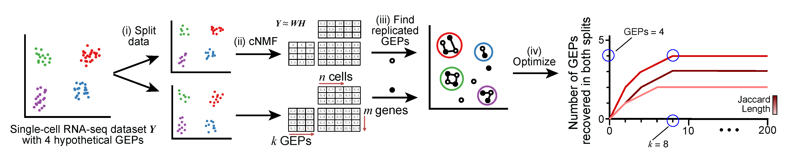

# acNMF (v1.0.0)
This repository describes the acNMF method, along with supporting code for subsequent analyses.
  

## acNMF on Simulated Data
The scripts to reproduce the acNMF analysis on simulated data can be found in the Simulated Data folder   
**Simulate.ipynb** Jupyter notebook modified from [cNMF publication](https://github.com/dylkot/cNMF/blob/master/Tutorials/analyze_simulated_example_data.ipynb) 
**acNMF_input.R** Convert file into acNMF compatable format 
**cNMF_runscript and cnmf_v2.0.py** Modified [cNMF](https://github.com/dylkot/cNMF/tree/master) code that enables faster runtimes on HPC environments 
**acNMF_output.R** Calculates Jaccard Similarity and plots results 

## Post-acNMF Analyses
The scripts to reproduce these analysis are found in the Post-acNMF Analysis folder.   
**inferCNV.R** Conducts inferCNV analysis using a pre-defined reference and the subclustering module.    
**DESeq2.R** Performs DESeq2 and GSEA on pseudobulked mouse scRNA-seq dataset.  
**velocyto.bsub and scvelo.py** Creates loom file and performs RNA velocity analysis, respectively.  
**Monocle.R** Calculates pseudotime trajectory plot for mouse dataset.  

## Scripts for Shiny App and Accompanying Gene Expression Progam Reports
